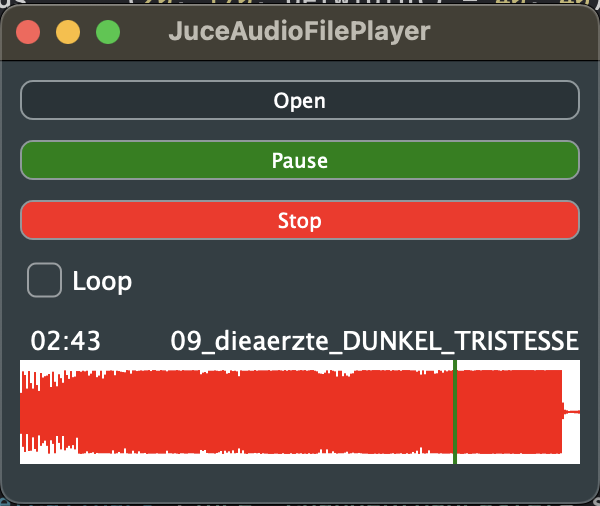

# JuceAudioFilePlayer

Based on the Juce tutorial ["Build an audio player"](https://docs.juce.com/master/tutorial_playing_sound_files.html), and [Draw audio waveforms](https://docs.juce.com/master/tutorial_audio_thumbnail.html). This is working on mobile devices too.
